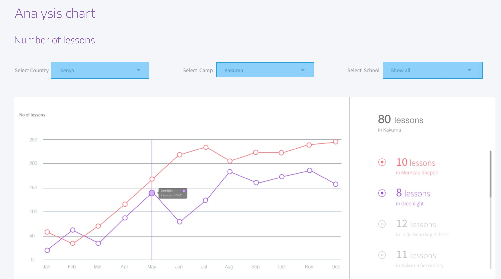

# Analysis Chart Front-End Challenge

The challenge is to implement an analytics dashboard like this one with the description below:

## Acceptance Criteria

1. A loading screen is expected while fetching the "data.json" from server. You can use the "raw" file directly from Github or serve it from a local server.
2. The 3 drop-down lists at the top should filter the data. "Select School" should have the option to "Show all".
3. A chart renders the data of the selected schools similarly to the image.
4. On the right of the screen, the total number of lessons is displayed for the selected Camp, School and Country, followed by a list of the schools with how many lessons each offers.
5. The schools list from point 4 should include toggles to show or hide the line chart of a certain school.
6. Upon clicking on a point in the chart from point 3, the app should navigate to another page where all the details of that item are shown. No UX is provided, but use a simple layout that shows: like country, camp, school, month and number of lessons.
7. After coming back from the details page implemented in point 6, the last filtering state should be preserved.

## Requirements

- Use Angular, TypeScript and Chart.js.
- Good unit-test cases is required to secure the code. Bonus if E2E testing is implemented.
- Store the data centrally by using any state-management library of your choice (EX: NgRx).
- The project should be performant and scalable. Try to follow best pratices in areas such as project structure, linting, components structure, layering, modularity.
- Bonus points:
    - Implement a toggle to switch on/off dark mode.
    - Multi-lingual support.

Note: The spec is vague on purpose. Please document in a separate markdown file any decisions you've made indicating your analysis and the justification for your choice. That documentation will be considered as part of the assessment.

